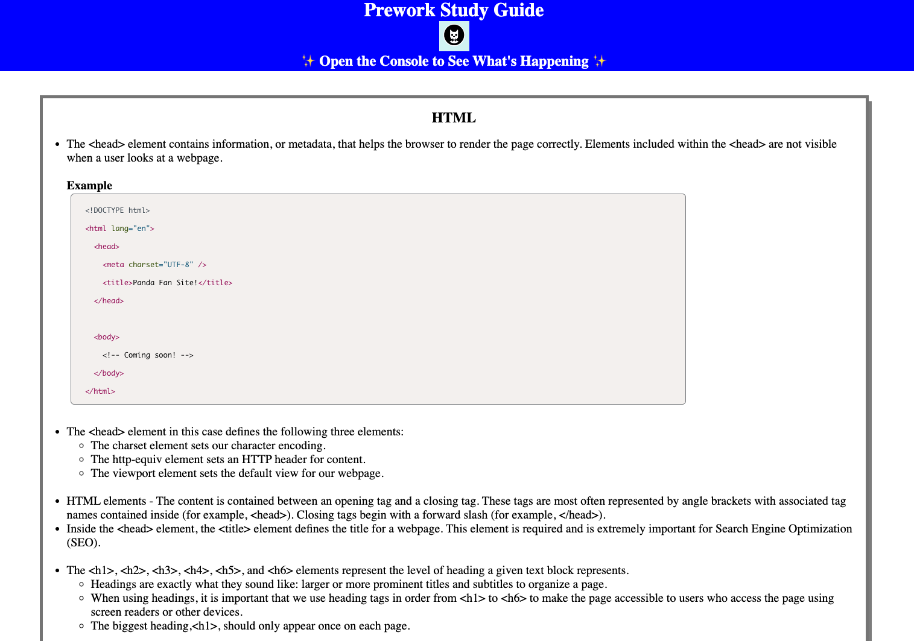
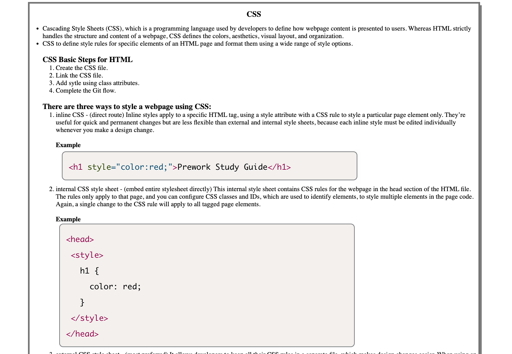
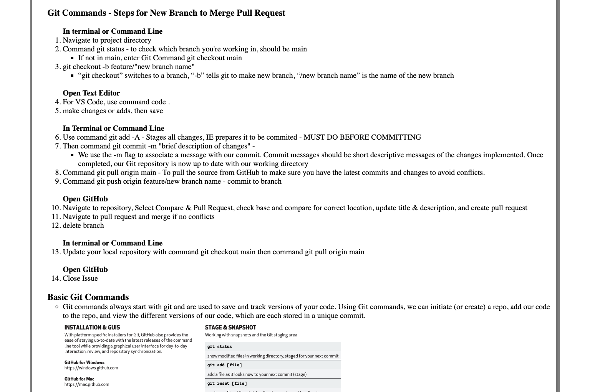

# Prework Study Guide Webpage

## Description

This Prework Study Guide was created with structure, indented related content, bold formatting, bulletins, order of operation, and screenshots for boot camp students working through prework. This project is designed to help the user understand core foundations of programming and how to use popular developer tools. The project also provides quick and easy access to important tips or notes to aid the user on future projects. On any study guide, it is important that the user not only follows the instructions but also understands the purpose. Once they understand the purpose, they will have the insight on how that information can be infinitely applied to various situations and circumstances. Through this project I learned about the overall work flow from Git, GitHub, terminal, and VS Code.           

## Installation

N/A

## Usage

This study guide includes information on HTML, CSS, JavaScript, and Git. The HTML section has screenshot examples and detailed notes on typical elements. The information outlines different kinds and how they are applied. The CSS section lists the basic steps for HTML, three different ways to style a webpage, guidelines, models and definitions. The Git section includes terms, tips, work flow from basic steps to full in depth instruction, typical Git commands with brief descriptions, and screenshots. The JavaScript section includes instruction on the console panel and when applied, JavaScript is seen running. This section also includes basic information related to control flow, conditional statements, arrays, loops, and functions.    

To add a screenshot, create an `assets/images` folder in your repository and upload your screenshot to it. Then, using the relative file path, add it to your README using the following syntax:

## Credits

N/A

## License

The last section of a high-quality README file is the license. This lets other developers know what they can and cannot do with your project. If you need help choosing a license, refer to [https://choosealicense.com/](https://choosealicense.com/).
